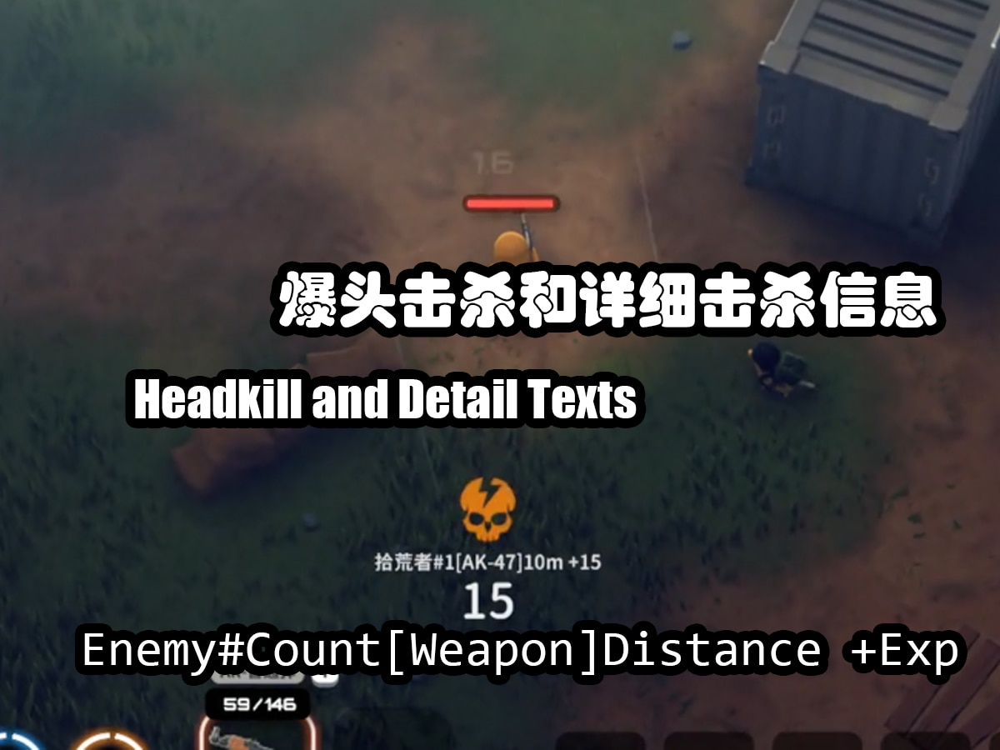

# 战地击杀反馈  
这是一个《[逃离鸭科夫](https://store.steampowered.com/app/3167020/_/)》的模组，旨在模拟《[战地5](https://www.ea.com/games/battlefield/battlefield-5)》的击杀反馈效果，以提高游戏过程中的杀敌爽快感。  
## 介绍与预览图片

# 安装与运行
## 获取模组与安装
可从以下两种方式中任选其一
### Steam创意工坊
在创意工坊中搜索"战地击杀反馈"可找到本模组，或者通过本链接：
[https://steamcommunity.com/sharedfiles/filedetails/?id=3593164987](https://steamcommunity.com/sharedfiles/filedetails/?id=3593164987)
在创意工坊中订阅本模组即可，本模组会被Steam自动下载到此位置：
`<SteamLibrary>/steamapps/workshop/content/3167020/3593164987`
### 手动安装
从本存储库或者其他地方下载到本模组的发行版，将文件放置在`Escape From Duckov/Duckov_Data/Mods`中，其中`Mods`目录若不存在则需要手动创建。建议确保本模组以套一层目录的形态放在`Mods`中，以免和其他模组缠绕交错。
## 运行依赖
本模组依赖Harmony运行，为游戏添加Harmony主要有两种方式。
### 第一种，订阅创意工坊中的HarmonyLib
如果你是Steam玩家，可以从创意工坊中订阅HarmonyLib。订阅之后打开游戏，请在Mods界面中确保HarmonyLib的排序位于本模组之上。
### 第二种，安装BepInEx
在[BepInEx的Github存储库](https://github.com/BepInEx/BepInEx)中下载BepInEx 5 Mono，这里给一个[5.4.23.4](https://github.com/BepInEx/BepInEx/releases/tag/v5.4.23.4)的链接，选择对应你电脑处理器架构的下载。将BepInEx安装于游戏即可，BepInEx自带HarmonyX，可用于为本模组提供依赖支持。
> 什么？BepInEx下好了怎么安装到游戏？教程一堆，自己找。
## 运行本模组
配置依赖完全就绪后，在Mods界面中打勾本模组即可。  
如果使用的是创意工坊中的HarmonyLib，初次调整顺序后可能需要重启一次游戏才能勾选本模组。(BepInEx用户无需留意)
# 自定义
本模组提供了配置文件可使玩家能够调整许多参数，还能够通过[FrozenFish259](https://github.com/FrozenFish259)的ModConfig在游戏内实时调整一部分参数，可达成如调整模组音量、图标位置偏移、更换音效包、开关隐藏换弹进度条功能等操作。注：ModConfig非必须安装，本模组可独立运行。  
此外，本模组具备一套精心设计的音效自定义功能和一个基本图像替换功能。  
关于配置文件和音频自定义、图像替换的详情请见[自定义参考文档](.github/Custom_README_zh.md)。

ModConfig相关链接：  
[Github存储库](https://github.com/FrozenFish259/duckov_mod_config)  
[创意工坊链接](https://steamcommunity.com/sharedfiles/filedetails/?id=3590674339)

### 使用ModConfig时的注意事项
ModConfig有自己专门的保存设置数据的地方，当你使用ModConfig修改了本模组的参数后，修改内容并不会反映到本模组的原生配置文件中，相对地，在原生配置文件中修改的参数也不会反映到ModConfig的本模组的设置中。本模组在加载时，ModConfig中的设置会覆盖原生配置文件的设置。注意！这种覆盖只作用于内存中，不会修改互相的设置文件。
